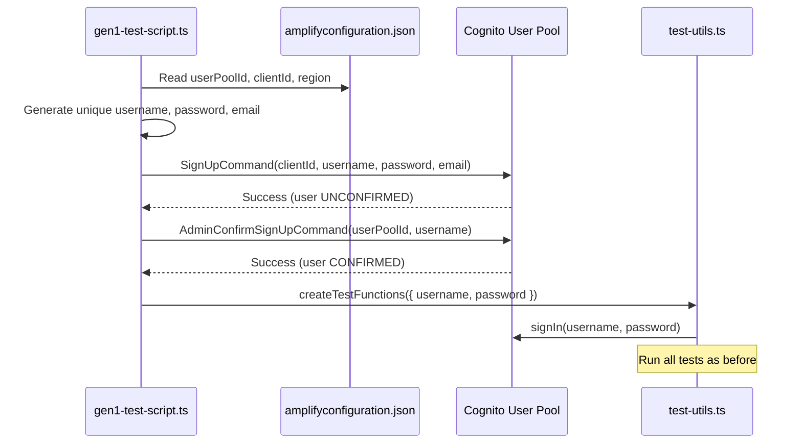

# Design Document: Automated Test User Creation for CI

## Overview

This design modifies `gen1-test-script.ts` to automatically provision a Cognito test user before running integration tests. The modification is minimal and inline — a single `createTestUser()` async function is added to the script that handles credential generation, user sign-up via the Cognito `SignUp` API, and confirmation via `AdminConfirmSignUp`. The generated credentials are then passed to the existing test infrastructure (`createTestFunctions`) without any changes to `test-utils.ts`.

The flow replaces the hardcoded `TEST_USER` block with dynamic provisioning:



## Architecture

The change is scoped entirely to `gen1-test-script.ts`. No new files are created. No existing files other than `gen1-test-script.ts` and `package.json` are modified.

### Modified Components

1. **`gen1-test-script.ts`** — Adds a `createTestUser()` function and replaces the hardcoded `TEST_USER` block with a call to it.
2. **`package.json`** — Adds `@aws-sdk/client-cognito-identity-provider` as a dev dependency.

### Unchanged Components

- **`test-utils.ts`** — No changes. The `TestUser` interface and `createTestFunctions` already accept `{ username, password }`.
- **`src/amplifyconfiguration.json`** — Read-only. Already contains all needed config values.

### CI Environment Assumptions

- The GitHub Actions runner has AWS credentials available (via IAM role or environment variables).
- The IAM permissions include `cognito-idp:AdminConfirmSignUp` for the target User Pool.
- The `cognito-idp:SignUp` action does not require IAM permissions (it's a public/client-side API authenticated by the Client ID).

## Components and Interfaces

### `createTestUser()` Function

A new async function added to `gen1-test-script.ts`:

```typescript
async function createTestUser(): Promise<{ username: string; password: string }>
```

**Responsibilities:**
1. Read config values from `amplifyconfiguration.json` (already imported as `amplifyconfig`)
2. Validate that `aws_user_pools_id` and `aws_user_pools_web_client_id` are present
3. Generate unique username, password, and email
4. Call `SignUpCommand` with the generated credentials
5. Call `AdminConfirmSignUpCommand` to confirm the user
6. Return `{ username, password }` for use by the test flow

**Error handling:** Any failure in steps 2-5 logs the error and calls `process.exit(1)`.

### Credential Generation

**Username format:** `ci-test-{timestamp}-{random4chars}`
- `timestamp`: `Date.now()` for ordering/debugging
- `random4chars`: 4 random hex characters for collision avoidance
- Example: `ci-test-1719432000000-a3f1`

**Password format:** A fixed prefix ensuring policy compliance + random suffix
- Structure: `CiTest1!` + 8 random alphanumeric characters
- The prefix guarantees: uppercase (`C`), lowercase (`i`, `est`), digit (`1`), special char (`!`)
- The suffix adds entropy
- Example: `CiTest1!k9mPx2qR`

**Email format:** `ci-test-{same-unique-component}@test.example.com`
- Uses the same unique component as the username for traceability
- Example: `ci-test-1719432000000-a3f1@test.example.com`

### SDK Client Setup

```typescript
import {
  CognitoIdentityProviderClient,
  SignUpCommand,
  AdminConfirmSignUpCommand,
} from '@aws-sdk/client-cognito-identity-provider';
```

The client is instantiated with the region from `amplifyconfig.aws_cognito_region`:

```typescript
const cognitoClient = new CognitoIdentityProviderClient({
  region: amplifyconfig.aws_cognito_region,
});
```

## Data Models

### Existing `TestUser` Interface (from `test-utils.ts`, unchanged)

```typescript
export interface TestUser {
  username: string;
  password: string;
}
```

The `createTestUser()` function returns an object matching this interface.

### Amplify Config Fields Used

| Field | Type | Purpose |
|-------|------|---------|
| `aws_user_pools_id` | `string` | User Pool ID for `AdminConfirmSignUp` |
| `aws_user_pools_web_client_id` | `string` | Client ID for `SignUp` |
| `aws_cognito_region` | `string` | Region for SDK client |

### SignUp Command Input

```typescript
{
  ClientId: amplifyconfig.aws_user_pools_web_client_id,
  Username: generatedUsername,
  Password: generatedPassword,
  UserAttributes: [{ Name: 'email', Value: generatedEmail }],
}
```

### AdminConfirmSignUp Command Input

```typescript
{
  UserPoolId: amplifyconfig.aws_user_pools_id,
  Username: generatedUsername,
}
```


## Correctness Properties

*A property is a characteristic or behavior that should hold true across all valid executions of a system — essentially, a formal statement about what the system should do. Properties serve as the bridge between human-readable specifications and machine-verifiable correctness guarantees.*

The testable surface of this feature is concentrated in the credential generation logic — the pure functions that produce usernames, passwords, and emails. The Cognito API integration is inherently an integration concern tested by running the script against a real User Pool.

### Property 1: Username uniqueness

*For any* set of N generated usernames (where N ≥ 2), all usernames in the set SHALL be distinct.

**Validates: Requirements 1.1**

### Property 2: Password policy compliance

*For any* generated password, the password SHALL be at least 8 characters long AND contain at least one uppercase letter, at least one lowercase letter, at least one digit, and at least one special character.

**Validates: Requirements 1.2**

### Property 3: Email format compliance

*For any* generated email, the email SHALL match the pattern `ci-test-{non-empty-string}@test.example.com`.

**Validates: Requirements 1.3**

## Error Handling

The error handling strategy is fail-fast: any failure during user provisioning terminates the script immediately with a non-zero exit code. This is appropriate for CI where partial test runs are worse than clear failures.

| Error Scenario | Handling |
|----------------|----------|
| Missing `aws_user_pools_id` in config | Log error, `process.exit(1)` |
| Missing `aws_user_pools_web_client_id` in config | Log error, `process.exit(1)` |
| `SignUpCommand` fails | Log Cognito error message, `process.exit(1)` |
| `AdminConfirmSignUpCommand` fails | Log Cognito error message, `process.exit(1)` |
| `signIn` fails (existing) | Already handled in `test-utils.ts` — returns `false`, script logs and returns |

Error messages should include the specific Cognito error message/code to aid debugging in CI logs.

## Testing Strategy

### Dual Testing Approach

- **Property tests**: Validate the credential generation functions (username, password, email generators) across many random inputs.
- **Unit tests**: Validate specific examples, edge cases (missing config fields), and error handling paths.

### Property-Based Testing

- **Library**: `fast-check` (TypeScript property-based testing library)
- **Configuration**: Minimum 100 iterations per property test
- **Tag format**: `Feature: automated-test-user-creation, Property {number}: {property_text}`

Each correctness property maps to a single property-based test:

| Property | Test Description |
|----------|-----------------|
| Property 1 | Generate 100+ usernames, assert all are unique |
| Property 2 | Generate 100+ passwords, assert each satisfies all policy requirements |
| Property 3 | Generate 100+ emails, assert each matches the expected format pattern |

### Unit Tests

- Config validation: test with missing/empty `aws_user_pools_id` and `aws_user_pools_web_client_id`
- Error handling: mock `SignUpCommand` failure, verify `process.exit(1)` is called
- Error handling: mock `AdminConfirmSignUpCommand` failure, verify `process.exit(1)` is called
- Happy path: mock both commands succeeding, verify returned `{ username, password }` matches generated values

### What Is NOT Tested

- The actual Cognito API calls (integration concern — tested by running the script in CI against the real User Pool)
- The existing test flow in `test-utils.ts` (unchanged, already validated)
- The Amplify `signIn` flow (unchanged, already validated)
